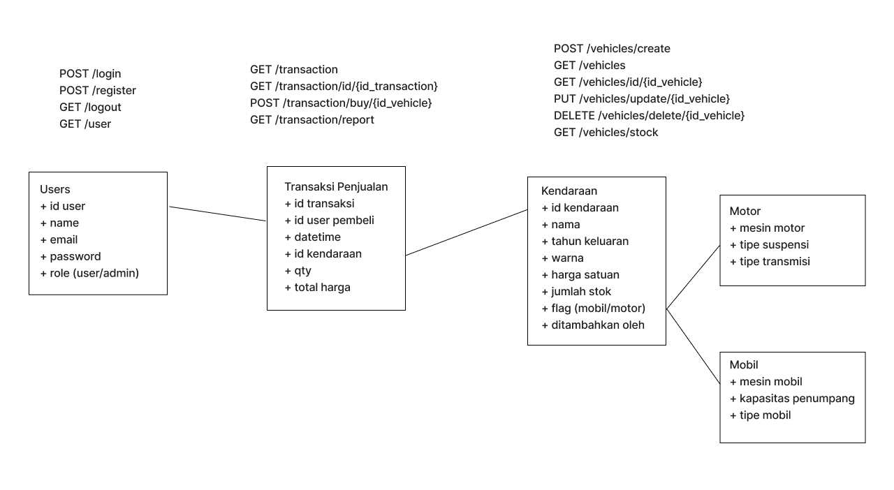

## Installation
Aplikasi menggunakan laravel v8, php v8.1.1, jenssegers/mongodb v3.8.5 
Konfigurasi mongodb
```
MONGO_DB_HOST=127.0.0.1
MONGO_DB_PORT=27017
MONGO_DB_DATABASE=dealership
MONGO_DB_USERNAME= {{dikosongkan}}
MONGO_DB_PASSWORD= {{dikosongkan}}
```

1. Menjalankan `composer update` untuk mengunduh library yang diperlukan dari composer
2. Menjalankan `php artisan migrate:fresh` untuk melakukan migrasi/membuat collection pada database mongodb
3. Menjalankan `php artisan db:seed --class=DatabaseSeeder` untuk mengisi database dengan data dummy
4. Run server dengan `php artisan serve`
5. Menjalankan testing `php artisan test`

## Data Schema & Routes Information
